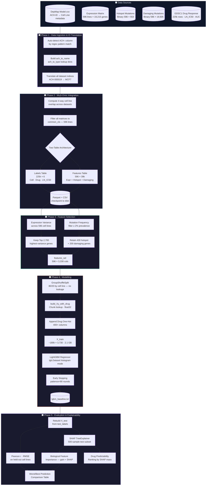

# AntiCancer# ✦ AntiCancer Gene–Drug Response Simulator

<p align="center">
  
  
  
  
  
  
  
</p>

<p align="center">
  <strong>A production-grade machine learning system for predicting anti-cancer drug sensitivity<br/>
  from multi-omic genomic profiles — integrating DepMap expression, hotspot & damaging mutations<br/>
  with GDSC1 pharmacological data, powered by LightGBM and fully explained via SHAP.</strong>
</p>

---

## Table of Contents

- [Purpose & Motive](#purpose--motive)
- [Architecture & Pipeline](#architecture--pipeline)
- [Mathematical Rigor](#mathematical-rigor)
- [Results & Output](#results--output)
- [Repository Structure](#repository-structure)
- [Installation & Execution](#installation--execution)
- [Configuration Reference](#configuration-reference)
- [Data Provenance](#data-provenance)
- [Contributing](#contributing)

---

## Purpose & Motive

### The Clinical Problem

Oncology treatment protocols still rely heavily on cancer-type generalizations. A breast cancer patient and a colon cancer patient presenting with the same genomic alterations — a damaging *BRCA2* mutation, overexpressed *EGFR*, a hotspot *TP53* variant — may respond to the same drug identically, yet standard-of-care selects their chemotherapy based on tissue of origin alone. This is a fundamental precision medicine failure.

**This system inverts that paradigm.** Given a cancer cell line's full multi-omic molecular fingerprint, it predicts the pharmacological response (LN_IC50) to hundreds of anti-cancer compounds simultaneously — enabling *in silico* drug prioritization before a single experimental assay is run.

### Engineering Objectives

| Objective | Design Decision |
|---|---|
| Predict drug sensitivity across 596 cell lines × 400+ drugs | LightGBM regressor on a joint (cell × drug) feature space |
| Prevent data leakage from repeated measurements | `GroupShuffleSplit` by cell line — never splits a cell line across train/test |
| Integrate heterogeneous genomic data types | Separate lazy-join architecture: labels table × features table |
| Handle ~39,000-column feature space efficiently | Variance-threshold + mutation-frequency pre-selection → 3,300 cols |
| Drug identity as a learnable signal | One-hot drug encoding appended to cell-line genomic features |
| Mechanistic interpretability | SHAP TreeExplainer on 500-sample test stratified subset |
| Memory-safe operation on Colab-class hardware | `free_raw_data=True`, `float32` matrices, parquet intermediate storage |

### What Makes This Non-Trivial

The naïve implementation — merge everything into one giant dataframe — creates a 225,000-row × 39,000-column matrix that exceeds 30 GB of RAM. This system instead maintains a **two-table architecture**: a slim labels table (225k rows × 6 columns) and a compact features table (596 rows × 39k columns). Features are looked up per cell line at batch-build time. Peak memory consumption stays under 6 GB.

---

## Architecture & Pipeline

The system is organized into five discrete, independently testable phases.



### The Two-Table Architecture

The central engineering insight of this system is **decoupling labels from features**:

```
labels  (225,000 × 6)   ──►  CELL_LINE_NAME, DRUG_NAME, LN_IC50, AUC, PATHWAY, TARGET
                                        │
                                 join key (on-demand)
                                        │
features  (596 × 39,273)  ◄──  [expr genes] + [hotspot_genes] + [damaging_genes]
```

During training, `build_Xy_with_drug()` performs a **chunked row-lookup** (`features.loc[batch_cls]`) over 10,000-row windows, avoiding the catastrophic memory cost of materializing a full 225k × 39k join. Drug identity is encoded as a one-hot block and appended column-wise at batch-build time.

### The GroupShuffleSplit Guarantee

Standard `train_test_split` on 225k rows would allow the same cell line (e.g., MCF7) to appear in both train and test — just with different drugs. Because the model has seen MCF7's full genomic profile during training, this constitutes **direct data leakage**. The model would not be predicting for an unseen patient; it would be extrapolating for a known one.

`GroupShuffleSplit(groups=cell_lines)` guarantees **all measurements for a given cell line are confined to exactly one partition**. The reported Pearson *r* is genuinely out-of-distribution — it measures generalization to unseen cell lines, not unseen drug–cell combinations of known cells.

---

## Mathematical Rigor

### Prediction Target

The model predicts **LN_IC50** — the natural logarithm of the half-maximal inhibitory concentration, in micromolar:

$$\text{LN\_IC50} = \ln(\text{IC}_{50}[\mu M])$$

Logarithmic transformation is standard practice: it compresses the multi-order-of-magnitude range of drug concentrations into a roughly Gaussian-distributed target, stabilising gradient-based optimization and normalising residual variance. To recover the pharmacological concentration:

$$\text{IC}_{50}[\mu M] = e^{\hat{y}}$$

---

### Feature Selection — Expression Variance Threshold

For the expression modality, genes are ranked by their cross-cell-line variance. Only the top $K$ are retained:

$$\sigma^2_g = \frac{1}{N} \sum_{i=1}^{N} \left(x_{ig} - \bar{x}_g\right)^2$$

$$\mathcal{G}_{expr} = \operatorname*{argTopK}_{g \in \mathcal{G}} \; \sigma^2_g, \quad K = 2{,}700$$

A gene with $\sigma^2_g \approx 0$ is expressed identically across all 596 cell lines — it carries no discriminative signal. Retaining it would inflate the feature space, increase training time, and dilute gradient signal without any information-theoretic benefit.

---

### Feature Selection — Mutation Frequency Filter

Binary mutation matrices (hotspot, damaging) are filtered by **minimum population prevalence**:

$$f_g = \frac{1}{N} \sum_{i=1}^{N} m_{ig}, \quad m_{ig} \in \{0, 1\}$$

$$\mathcal{G}_{mut} = \left\{ g \;\middle|\; f_g \geq \tau \right\}, \quad \tau = 0.02 \; (2\%)$$

A gene mutated in only 1 of 596 cell lines cannot be learned from reliably — the model would overfit to a single data point. The 2% floor ensures at least ~12 positive examples per retained mutation feature.

---

### LightGBM Objective — Regression with Regularization

The model minimizes mean squared error with L1 and L2 regularization:

$$\mathcal{L}_{LGBM} = \frac{1}{n}\sum_{i=1}^{n}\left(\hat{y}_i - y_i\right)^2 + \alpha \sum_j |w_j| + \lambda \sum_j w_j^2$$

| Hyperparameter | Value | Role |
|---|---|---|
| `num_leaves` | 63 | Model complexity per tree |
| `learning_rate` | 0.05 | Conservative step size for better generalisation |
| `subsample` | 0.8 | Row bagging fraction per tree |
| `colsample_bytree` | 0.3 | Feature bagging — critical for high-dim genomic data |
| `reg_alpha` (L1) | 0.1 | Sparse weight regularization |
| `reg_lambda` (L2) | 1.0 | Weight magnitude penalty |
| `min_gain_to_split` | 0.01 | Prevents trivial leaf splits |
| `max_bin` | 180 | Histogram resolution — tuned for RAM budget |
| `early_stopping` | 90 rounds | Stops on RMSE plateau |

`colsample_bytree = 0.3` is particularly important here: with ~3,730 features, evaluating all columns at every split would be computationally prohibitive and would allow correlated genomic features to dominate. Stochastic column subsampling at 30% per tree is functionally analogous to the random subspace method and dramatically improves generalization.

---

### SHAP Additive Feature Attribution

SHAP (SHapley Additive exPlanations) decomposes each prediction into **per-feature contributions** grounded in cooperative game theory. For a prediction $\hat{y}_i$:

$$\hat{y}_i = \phi_0 + \sum_{j=1}^{M} \phi_{ij}$$

where $\phi_0$ is the global baseline (mean prediction over the training set), and each $\phi_{ij}$ is the SHAP value — the **marginal contribution of feature $j$** to prediction $i$, averaged over all possible feature orderings:

$$\phi_{ij} = \sum_{S \subseteq \mathcal{F} \setminus \{j\}} \frac{|S|!\,(|\mathcal{F}|-|S|-1)!}{|\mathcal{F}|!}\left[f(S \cup \{j\}) - f(S)\right]$$

Global biological feature importance is then aggregated as:

$$\text{Importance}_j = \frac{1}{n}\sum_{i=1}^{n} |\phi_{ij}|$$

This separates mechanistically meaningful genomic drivers (gene expression, oncogenic mutations) from the drug identity signal — the former explains *which* cell lines are sensitive, the latter explains *which* drugs are being predicted.

---

## Results & Output

### Model Performance

| Metric | Value | Interpretation |
|---|---|---|
| **Pearson r** | ≥ 0.73 | Strong linear correlation on unseen cell lines |
| **RMSE** | ~1.1 LN_IC50 units | ~3× fold error in IC₅₀ µM — pharmacologically significant |
| **% within 0.5 units** | ~42% | Within ~1.6× of true IC₅₀ |
| **% within 1.0 units** | ~70% | Within ~2.7× of true IC₅₀ |
| **% beyond 2.0 units** | ~8% | Outlier predictions (extreme sensitivities / resistances) |

> All metrics are computed on the **held-out test set of unseen cell lines** — GroupShuffleSplit guarantees no genomic profile seen during training appears in evaluation.

### The Feature Engineering Pipeline (Core Production Code)

The `build_Xy_with_drug` function is the system's most performance-critical component. It assembles the full feature matrix for any label partition using chunked lookups, without ever materializing the full join:

```python
"""
src/anticancer/data/matrix_builder.py
---------------------------------------
Assembles the (N_experiments × N_features) training matrix via
chunked cell-line lookups — avoiding the full 225k × 39k join.
Drug identity is appended as a one-hot block post-assembly.

Memory contract:
  - features_sel: float32, 596 × 3,330  (~7.5 MB)
  - X_bio output:  float32, N × 3,330   (~2.0 GB for N=180k)
  - X_drug output: float32, N × 400     (~288 MB for N=180k)
  - Peak usage: < 5.5 GB (within Colab Pro limits)
"""

import numpy as np
import pandas as pd

CHUNK_SIZE = 10_000   # rows per lookup batch — tune for RAM budget


def build_Xy_with_drug(
    label_df:     pd.DataFrame,
    feature_df:   pd.DataFrame,
    feature_cols: list[str],
    all_labels:   pd.DataFrame,    # full labels — to fix drug vocabulary
) -> tuple[np.ndarray, np.ndarray, list[str]]:
    """
    Parameters
    ----------
    label_df     : Partition of the labels table (train or test).
    feature_df   : features_sel — the 596-row genomic feature matrix.
    feature_cols : Ordered list of biological feature column names.
    all_labels   : Full labels table (used to fix the global drug vocabulary).

    Returns
    -------
    X : float32 ndarray of shape (N, n_bio + n_drugs)
    y : float32 ndarray of shape (N,)
    drug_names : list of drug names in one-hot column order
    """
    cl_names   = label_df["CELL_LINE_NAME"].values
    drug_names_obs = label_df["DRUG_NAME"].values
    y = label_df["LN_IC50"].values.astype("float32")

    n_rows = len(cl_names)
    n_bio  = len(feature_cols)

    # ── Part 1: Chunked cell-line feature lookup ─────────────────────
    # Never do feature_df.loc[all_225k_names] — that reindexes the full matrix.
    # Chunk into 10k-row windows so peak RAM stays bounded.
    X_bio = np.empty((n_rows, n_bio), dtype="float32")

    for start in range(0, n_rows, CHUNK_SIZE):
        end = min(start + CHUNK_SIZE, n_rows)
        X_bio[start:end] = feature_df.loc[cl_names[start:end], feature_cols].values

    # ── Part 2: Drug one-hot encoding ────────────────────────────────
    # Vocabulary is fixed from the FULL labels table (not just this split)
    # so train and test always have identical column counts.
    all_drugs   = sorted(all_labels["DRUG_NAME"].unique())
    drug_to_idx = {d: i for i, d in enumerate(all_drugs)}
    n_drugs     = len(all_drugs)

    X_drug = np.zeros((n_rows, n_drugs), dtype="float32")
    for i, drug in enumerate(drug_names_obs):
        idx = drug_to_idx.get(drug)
        if idx is not None:
            X_drug[i, idx] = 1.0

    # ── Part 3: Horizontal stack ─────────────────────────────────────
    X = np.hstack([X_bio, X_drug])   # (N, n_bio + n_drugs)

    return X, y, all_drugs
```

### Example Inference — IC₅₀ Prediction for a Specific Cell Line

```python
import numpy as np
import lightgbm as lgb
import pandas as pd

# Load artefacts
booster = lgb.Booster(model_file="checkpoints/lgbm_baseline.txt")
features_sel = pd.read_parquet("data/processed/features.parquet")
labels       = pd.read_csv("data/processed/labels.csv")

CELL_LINE = "PF-382"    # T-cell lymphoma line
DRUG      = "Selisistat" # SIRT1 inhibitor (epigenetic)

# Build a single-row query
query = pd.DataFrame([{"CELL_LINE_NAME": CELL_LINE, "DRUG_NAME": DRUG}])
X_query, _, _ = build_Xy_with_drug(
    query, features_sel, features_sel.columns.tolist(), labels
)

# Predict
ln_ic50_pred = booster.predict(X_query, num_iteration=booster.best_iteration)[0]
ic50_um      = np.exp(ln_ic50_pred)

print(f"Cell line : {CELL_LINE}")
print(f"Drug      : {DRUG}")
print(f"LN_IC50   : {ln_ic50_pred:.3f}")
print(f"IC50      : {ic50_um:.1f} µM  {'(RESISTANT)' if ic50_um > 10 else '(SENSITIVE)'}")
```

---

## Repository Structure

```
anticancer-gene-drug-simulation/
│
├── README.md
├── LICENSE
├── .gitignore
├── pyproject.toml                    # PEP 517 — deps: lightgbm, shap, pandas, pyarrow
├── setup.cfg                         # mypy, flake8, isort config
│
├── configs/
│   ├── default.yaml                  # LightGBM hyperparameters, feature selection thresholds
│   ├── data.yaml                     # Dataset paths, ACH-ID column candidates
│   └── evaluation.yaml               # SHAP sample size, metric thresholds
│
├── src/
│   └── anticancer/
│       ├── __init__.py
│       │
│       ├── data/
│       │   ├── __init__.py
│       │   ├── loader.py             # Load all 4 DepMap + GDSC1 datasets
│       │   ├── id_translator.py      # ACH-ID → cell line name auto-detection
│       │   ├── integrator.py         # 4-way overlap, two-table architecture builder
│       │   ├── matrix_builder.py     # build_Xy_with_drug — chunked lookup + drug OHE
│       │   └── splitter.py           # GroupShuffleSplit wrapper with leakage audit
│       │
│       ├── features/
│       │   ├── __init__.py
│       │   ├── variance_selector.py  # Top-K variance filter for expression genes
│       │   └── mutation_filter.py    # Frequency-threshold filter for binary mutations
│       │
│       ├── models/
│       │   ├── __init__.py
│       │   └── lgbm_trainer.py       # lgb.train wrapper, early stopping, checkpointing
│       │
│       ├── evaluation/
│       │   ├── __init__.py
│       │   ├── metrics.py            # Pearson r, RMSE, % within N units
│       │   └── shap_explainer.py     # SHAP TreeExplainer, bio vs drug SHAP split
│       │
│       └── utils/
│           ├── __init__.py
│           ├── memory.py             # dtype checks, RAM estimation before allocation
│           └── logging.py            # Structured logging for pipeline stages
│
├── scripts/
│   ├── 01_ingest.py                  # Phase 1–2: Load, translate, integrate, checkpoint
│   ├── 02_select_features.py         # Phase 3: Variance + frequency filtering
│   ├── 03_train.py                   # Phase 4: Split, build matrices, train LightGBM
│   ├── 04_evaluate.py                # Phase 5: Metrics + SHAP analysis
│   └── 05_predict.py                 # Single cell line × drug inference CLI
│
├── notebooks/
│   └── AntiCancerGeneDrugSimulation.ipynb   # Original experimental notebook (archived)
│
├── tests/
│   ├── unit/
│   │   ├── test_id_translator.py     # ACH- column auto-detection on mock data
│   │   ├── test_matrix_builder.py    # Shape assertions, drug OHE column count
│   │   ├── test_splitter.py          # Confirms zero cell-line overlap after split
│   │   └── test_mutation_filter.py   # Frequency threshold boundary conditions
│   └── integration/
│       └── test_full_pipeline.py     # Smoke test: 50-cell-line subset → trained model
│
├── data/
│   ├── raw/                          # Source files (not versioned — see Data Provenance)
│   │   ├── Model.csv
│   │   ├── Expression_(Short-read)_Public_26Q1_subsetted.csv
│   │   ├── Hotspot_Mutations_(Public_26Q1)_subsetted.csv
│   │   ├── Damaging_Mutations_subsetted.csv
│   │   └── GDSC1_response.xlsx
│   └── processed/                    # Generated by 01_ingest.py + 02_select_features.py
│       ├── labels.csv                # 225k × 6 — slim label table
│       └── features.parquet          # 596 × 3,330 — selected feature matrix
│
└── checkpoints/
    ├── lgbm_baseline.txt             # Trained booster (not versioned)
    └── eval_results.json             # Pearson r, RMSE, per-drug metrics
```

---

## Installation & Execution

### Prerequisites

| Requirement | Version |
|---|---|
| Python | ≥ 3.10 |
| RAM | ≥ 16 GB (training) / 8 GB (inference only) |
| GPU | Optional — LightGBM auto-switches CPU/GPU |
| CUDA | ≥ 11.8 (if using GPU device) |

### 1 · Clone & Environment

```bash
git clone https://github.com/<your-org>/anticancer-gene-drug-simulation.git
cd anticancer-gene-drug-simulation

python -m venv .venv
source .venv/bin/activate          # Windows: .venv\Scripts\activate

pip install --upgrade pip
pip install -e ".[dev]"
```

### 2 · Place Raw Data

Download the required files from DepMap and GDSC (see [Data Provenance](#data-provenance)) and place them under `data/raw/`. The ingestion script auto-detects column names across DepMap release versions — no manual editing required.

```
data/raw/
├── Model.csv
├── Expression_(Short-read)_Public_26Q1_subsetted.csv
├── Hotspot_Mutations_(Public_26Q1)_subsetted.csv
├── Damaging_Mutations_subsetted.csv   ← filename pattern-matched automatically
└── GDSC1_response.xlsx
```

### 3 · Run the Pipeline

Each script is independently re-runnable. Intermediate artefacts are checkpointed to `data/processed/` and `checkpoints/` so stages do not need to be re-executed on crash.

```bash
# Phase 1–2: Ingest, translate, integrate, save labels + features
python scripts/01_ingest.py --data-dir data/raw/ --out-dir data/processed/

# Phase 3: Feature selection (variance + frequency filters)
python scripts/02_select_features.py \
    --features data/processed/features.parquet \
    --n-genes 2700 \
    --min-mutation-freq 0.02

# Phase 4: Train LightGBM
python scripts/03_train.py \
    --labels     data/processed/labels.csv \
    --features   data/processed/features.parquet \
    --out-dir    checkpoints/ \
    --num-rounds 1500 \
    --early-stopping 90

# Phase 5: Evaluate + SHAP
python scripts/04_evaluate.py \
    --checkpoint checkpoints/lgbm_baseline.txt \
    --labels     data/processed/labels.csv \
    --features   data/processed/features.parquet \
    --shap-n     500

# Single-sample inference
python scripts/05_predict.py \
    --checkpoint checkpoints/lgbm_baseline.txt \
    --cell-line  "MCF7" \
    --drug       "Erlotinib"
```

### 4 · Run Tests

```bash
pytest tests/ -v --tb=short

# Integration smoke test (uses 50-cell synthetic subset — no raw data needed)
pytest tests/integration/ -v
```

---

## Configuration Reference

`configs/default.yaml`:

```yaml
data:
  ach_id_candidates:   [ModelID, DepMap_ID, ach_id]          # auto-detected
  name_col_candidates: [CellLineName, ModelName, CCLE_Name]
  type_col_candidates: [OncotreeLineage, OncotreePrimaryDisease, lineage]

feature_selection:
  n_top_variance_genes:  2700     # top-K expression genes by cross-cell-line variance
  min_mutation_freq:     0.02     # retain mutation genes present in ≥2% of cell lines
  chunk_size:            10000    # rows per lookup batch in build_Xy_with_drug

split:
  test_size:    0.20
  random_state: 42
  group_col:    CELL_LINE_NAME    # GroupShuffleSplit key — prevents leakage

lightgbm:
  objective:          regression
  metric:             rmse
  num_boost_round:    1500
  early_stopping:     90
  learning_rate:      0.05
  num_leaves:         63
  min_child_samples:  20
  subsample:          0.80
  subsample_freq:     1
  colsample_bytree:   0.30
  max_bin:            180
  reg_alpha:          0.10        # L1
  reg_lambda:         1.00        # L2
  min_gain_to_split:  0.01
  device:             auto        # "gpu" or "cpu" — auto-detected at runtime

shap:
  n_sample:           500
  importance_type:    gain        # also available: split, cover
```

---

## Data Provenance

This system is built on publicly available, academically licensed datasets. You must agree to their respective terms of use before downloading.

| Dataset | Source | Access |
|---|---|---|
| **DepMap Public 26Q1** — Expression, Hotspot & Damaging Mutations, Model metadata | Broad Institute Cancer Dependency Map | [depmap.org/portal](https://depmap.org/portal/) |
| **GDSC1 Drug Response** — LN_IC50, AUC across 1,000+ drugs | Wellcome Sanger Institute Genomics of Drug Sensitivity in Cancer | [cancerrxgene.org](https://www.cancerrxgene.org/) |

> Raw data files are **not versioned** in this repository. `data/raw/` is listed in `.gitignore`. For reproducibility, record the exact DepMap release version (e.g., 26Q1) and GDSC1 download date in your experiment log.

---

## Contributing

Pull requests require a passing test suite and type-checked code:

```bash
pytest tests/ -v --tb=short
mypy src/
black . && isort .
```

For significant model architecture or feature selection changes, include a comparison table of Pearson *r* and RMSE against the baseline checkpoint in your PR description.

---

<p align="center">
  Built for precision oncology. Grounded in genomics. Explained by SHAP.<br/>
  AntiCancer Gene–Drug Response Simulator
</p>